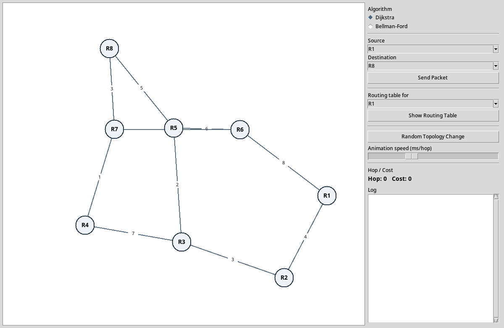
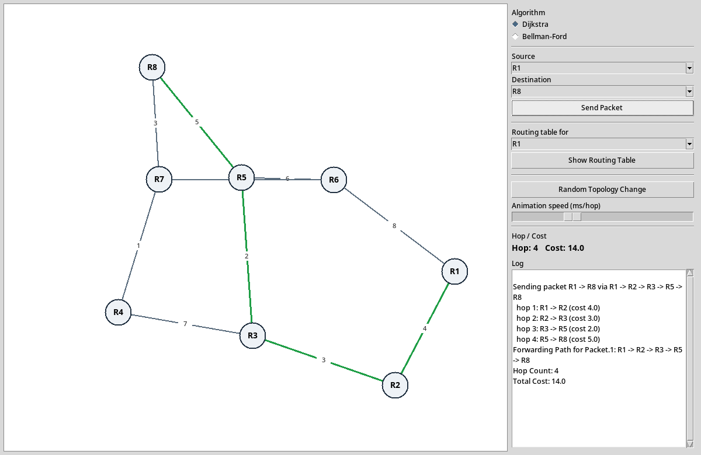
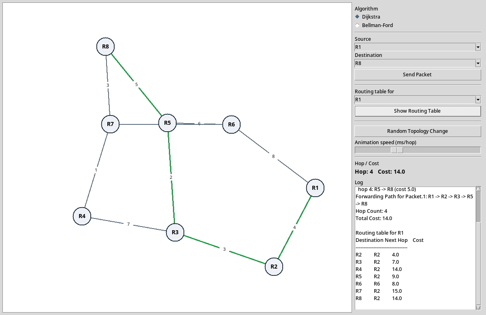
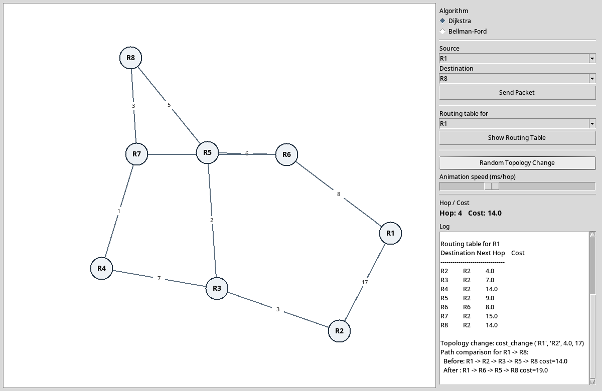
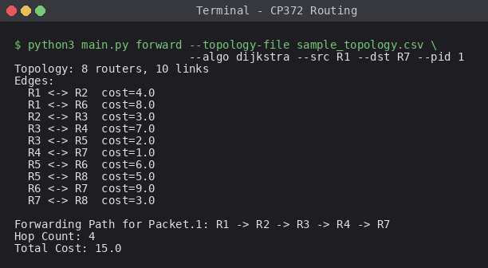
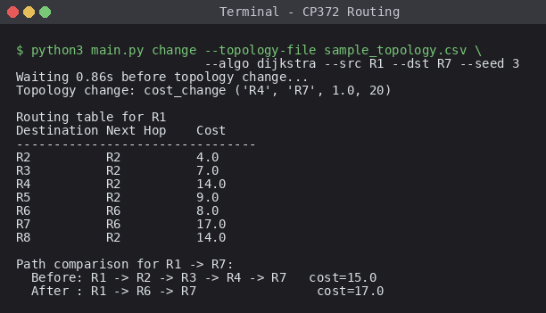
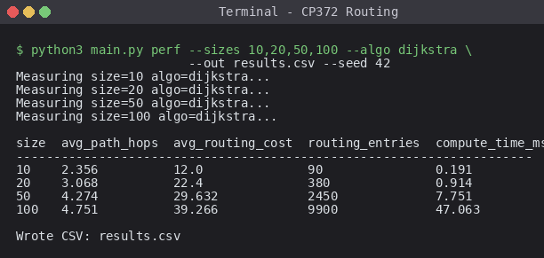

# CP372 Assignment 3 – Routing Algorithms

Python 3 network simulator implementing Dijkstra (link-state) and Bellman-Ford
(distance-vector) routing, packet forwarding, topology-change simulation, and a
performance analysis suite.

## Requirements

- Python 3.8+
- Optional: `matplotlib` (only for `perf` plots). Without it the CSV is still
  written and a note is printed.

Install matplotlib (optional):

```
pip install matplotlib
```

## Files

- `topology.py` – topology loader, random generator, mutation ops
- `algorithms.py` – Dijkstra, Bellman-Ford, table formatter
- `router.py` – Router class with `receive` / `originate`
- `packet.py` – Packet class
- `simulator.py` – wiring, packet forwarding, topology-change scenario
- `performance.py` – Part E experiments
- `main.py` – CLI dispatcher
- `sample_topology.csv` – 8-router example

## Topology file format

CSV adjacency matrix. First row and first column are router labels. Empty cell
(or `inf`, `-`, `x`) means no link. `0` on the diagonal. Costs are numeric.

## CLI usage

```
python3 main.py table    --random 12 --seed 42 --algo dijkstra --router R1
python3 main.py forward  --random 12 --seed 42 --algo dijkstra --src R1 --dst R6 --pid 1
python3 main.py change   --random 15 --seed 7  --algo bellman-ford --src R1 --dst R9
python3 main.py perf     --sizes 10,20,50,100 --algo dijkstra --out results.csv
python3 main.py compare  --random 20
python3 main.py table    --topology-file sample_topology.csv --algo dijkstra --router R1
```

Topology source is either `--topology-file PATH` or `--random N [--seed S]`.

## Commands

- `table` – print a router's routing table (Destination | Next Hop | Cost)
- `forward` – simulate a packet hop-by-hop from `--src` to `--dst`
- `change` – wait a random short time, apply one random change (link failure,
  new link, cost change, or router failure), recompute, and print
  before/after paths for the chosen `--src`/`--dst`
- `perf` – run experiments for `--sizes` (comma separated), print a table,
  write CSV, and (if matplotlib present) save PNG plots next to the CSV
- `compare` – run both algorithms on the same topology, print timings and
  verify the resulting shortest-path costs agree
- `gui` – open a Tkinter window visualizing the network and packet forwarding

## Flag reference

Topology source flags (accepted by `table`, `forward`, `change`, `compare`, `gui`):

| Flag | Value | Purpose |
|------|-------|---------|
| `--topology-file PATH` | path to CSV | Load an existing adjacency-matrix topology from disk. Mutually exclusive with `--random`. |
| `--random N` | integer | Generate a connected random topology with N routers. Mutually exclusive with `--topology-file`. |
| `--seed S` | integer | Seed the pseudo-random generator so runs are reproducible. Affects random topology generation and, for the `change` command, which random modification is applied. |

Algorithm and routing flags:

| Flag | Values | Default | Purpose |
|------|--------|---------|---------|
| `--algo` | `dijkstra` \| `bellman-ford` | `dijkstra` | Which shortest-path algorithm to use when computing routing tables. |
| `--router R` | router label (e.g. `R1`) | – | (`table` only) Which router's routing table to print. |
| `--src R` | router label | – | (`forward`, `change`) Source router for the packet or path comparison. |
| `--dst R` | router label | – | (`forward`, `change`) Destination router. |
| `--pid N` | integer | `1` | (`forward` only) Packet ID printed in the forwarding log. |

Performance experiment flags (`perf` command):

| Flag | Value | Default | Purpose |
|------|-------|---------|---------|
| `--sizes` | comma-separated ints | `10,20,50,100` | Network sizes to benchmark. |
| `--out` | path | `results.csv` | Where to write the CSV results. PNG plots (if `matplotlib` is installed) are written alongside using this base name. |
| `--seed` | integer | `42` | Seed used for both topology generation and the post-experiment random change. |
| `--algo` | as above | `dijkstra` | Algorithm to benchmark. |

Every subcommand also accepts `--help`, e.g. `python3 main.py forward --help`, which prints the flags applicable to that command.

## GUI

Launch the visualization (requires Tkinter, part of the Python standard
library:

```
python3 main.py gui --random 12 --seed 42 --algo dijkstra
python3 main.py gui --topology-file sample_topology.csv --algo bellman-ford
```

The window has a canvas on the left showing routers (R1..RN) as labeled
circles and links as edges annotated with cost. The right-hand panel
provides:

- Algorithm radio buttons (Dijkstra / Bellman-Ford) – switching recomputes
  the routing tables.
- Source / Destination dropdowns and a `Send Packet` button, which animates
  a colored dot moving hop-by-hop along the computed path and prints a
  three-line summary (`Forwarding Path`, `Hop Count`, `Total Cost`) in the
  log.
- A router dropdown plus `Show Routing Table` button that dumps the
  selected router's table into the log.
- `Random Topology Change` applies one of link-failure / add-link /
  cost-change / router-failure, redraws the affected element (fade,
  flash, or color shift), recomputes tables, and prints a before/after
  path comparison for the current src/dst.
- A speed slider controls per-hop animation delay. Failed routers turn red.

## Screenshots

Saved under `screenshots/`.

### GUI


*`gui_initial.png` — GUI on launch, showing the sample topology.*


*`gui_sent.png` — GUI after sending a packet from R1 to R8. Green edges mark the Dijkstra shortest path; per-hop log on the right.*


*`gui_table.png` — GUI showing R1's routing table dumped into the log via `Show Routing Table`.*


*`gui_change.png` — GUI after a random `cost_change` event on the R1–R2 link (4 → 17), with the before/after path comparison for R1 → R8 in the log.*

### CLI


*`cli_forward.png` — Output of `python3 main.py forward` on the sample topology (R1 → R7).*


*`cli_change.png` — Output of `python3 main.py change` with a `cost_change` event and the before/after path comparison.*


*`cli_perf.png` — Output of `python3 main.py perf` across network sizes 10, 20, 50, 100 with Dijkstra.*
